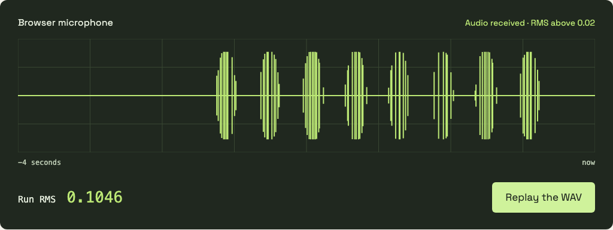

# Voice Debug Harness

**Same audio. Every test.**

Feed a WAV into a Chromium microphone from Playwright. Your app receives it
through `getUserMedia()`, so you can repeat a voice test without speaking into
your laptop.



[Watch the recording](docs/assets/microphone-demo.webm) · [API & CLI reference](docs/reference.md) · [MIT license](LICENSE)

## Try it

You need Node.js 20 or later.

```sh
git clone https://github.com/firstbitelabsllc/voice-debug-harness.git
cd voice-debug-harness
npm ci
npx playwright install chromium
npm run demo
```

Click **Feed the WAV**. The browser microphone starts quiet, receives the
2.4-second fixture, then returns to silence. The waveform and RMS value come
from a Web Audio analyser connected to that stream. Close the window to exit.

## Use it in a test

Install the cloned package in your project with `npm install /path/to/voice-debug-harness`.

```js
import { readFile } from "node:fs/promises";
import { installMicFeed, feedAudio } from "voice-debug-harness";

await installMicFeed(page);
await page.goto("http://localhost:3000");
await page.getByRole("button", { name: "Start listening" }).click();

const wav = await readFile("fixtures/hello.wav");
await feedAudio(page, wav);
// Assert what your app should do after hearing the clip.
```

Install the override before navigation; feed audio after your app opens its
microphone. Use a disposable Chromium context. The package makes no network
calls and needs no model account.

Bring a mono PCM16 speech recording to test words. The bundled fixture is
synthetic audio for checking the microphone path; it is not speech.

## Run the checks

```sh
npm test                 # WAV handling, energy measurement, input validation
npm run test:browser     # quiet microphone → WAV feed → measured audio
npm run test:consumer    # install and use the packed package
```

The browser check fails if the microphone is noisy before the feed or its
mean RMS stays at or below 0.02 afterward. Speech recognition and your app's
response need their own assertions.

To reproduce the screenshot and recording, run `npm run demo:record`. See
[the example source](examples/demo.mjs) and [capture notes](docs/capture.md).

If something fails, open an [issue](https://github.com/firstbitelabsllc/voice-debug-harness/issues)
with the command and its output.
